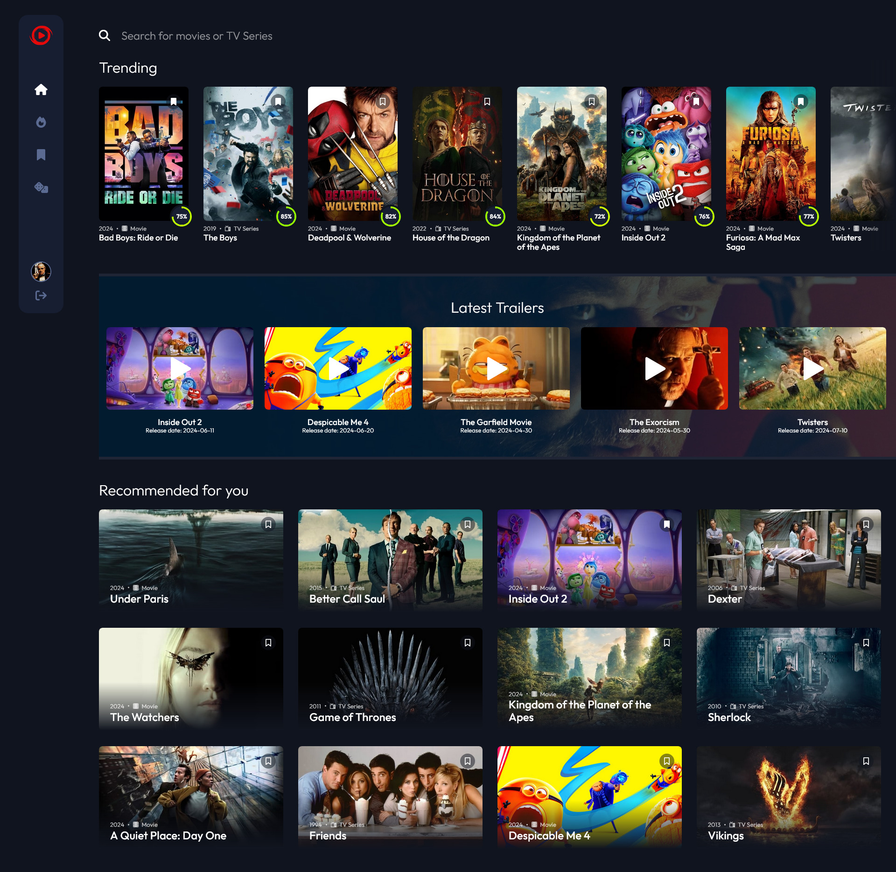
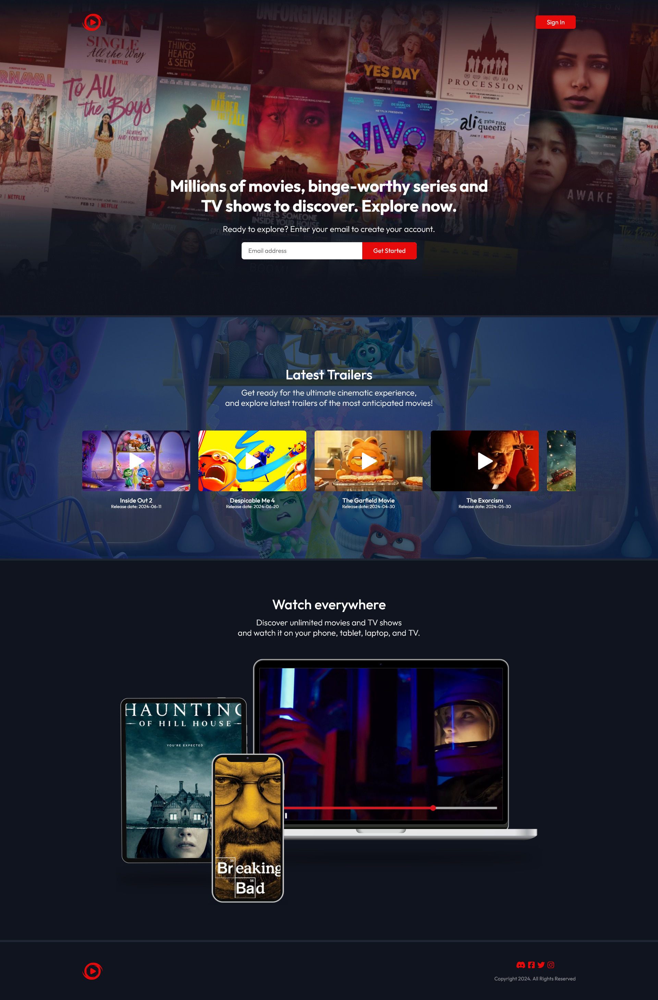

# MovieDB fullstack app

**MovieDB** is a **full-stack** application written in vanilla JavaScript that serves as an interactive hub for movie and TV series enthusiasts. To provide seamless *user authentication* and *data management* I used **Supabase** backend-as-a-service (BaaS) solution. This integration ensures secure user *registration* and *login* process, efficient *session management* which enables users to build their own collection by *bookmarking* favorite movies and TV series as well as completing profile with data and custom avatar with all user-specific data securely stored in the database and storage. App fetches data from **The Movie Database (TMDb) API** to deliver up-to-date and extensive information on films and TV shows. Both API and database operations are handled on **Netlify serverless functions** backend to reduce the load on the frontend, leading to faster response times and a more responsive user experience. This allows for better management of sensitive data, as **environment variables** can be *securely* stored and accessed only on the server side, removing the risk of exposure in client-side code. MovieDB App allows users to *explore, search, bookmark,* *create* their own *user profile* and engage with a vast collection of media content as well as display information about a specific movie/TV series on sub-page.

With the integration of user authentication I've decided to elevate app functionality and user experience by **designing an landing page** that serves as the introduction to MovieDB App. This landing page streamlines the user authentication process by providing registration form and login cta button redirecting respectively to *register* and *login* sub-page. Moreover showcases selection of popular movie trailers in slider that users can watch in popping lightbox modal that has trapped focus for users that require accessibility features. Additionally, there is a placeholder section with mockup image that contain video within.

After logging in, the user is redirected to the app which is based on the **single page application** (SPA) architecture with custom router. For handling bookmark state across SPA I created **central state management system** - bookmarkManager. This allows components to subscribe to bookmark updates and receive notifications when bookmarks change without the need of fetching it from database. If user navigate to route that doesn't exists router will **redirect to 404 page**. To improve user experience while fetching data I implemented **shimmer effect** which is simply visual feedback during data fetching. User can **login on test account** to explore app without the need to register, but test account is limited when it comes to updating profile with custom informations/avatar.

#### Demo:
- Live Site URL: [moviedb.netlify.app](https://moviedb.netlify.app/)

#### App Features:
- **User Authentication**: Users can create an account by providing email and password  and then log in to the app using their credentials, providing a secure and personalized experience.
- **Search**: The app includes a search functionality that allows users to search for movies or TV series by title. Upon submitting a search query, the app fetches and displays relevant search results, making it easy for users to find their desired content.
- **Trending section**: Dedicated trending section where users can view a list of currently trending movies or TV series. This section is updated regularly, ensuring that users stay informed about the latest movies or TV series.
- **Latest Trailers**: App showcases a selection of popular movie and TV series trailers in a slider. Users can watch them in a lightbox modal that includes accessibility features such as trapped focus for users who require it.
- **Recommended for You**: Personalized feature that suggests movies and TV series based on the titles you have bookmarked ensuring that you discover new content that aligns with your tastes.
- **Top rated page**: Features a list of the top 100 movies and TV series, ranked based on their overall user ratings.
- **Bookmarks page**: Personalized space where users can store and manage their bookmarked movies and TV series. This feature allows users to keep track of their favorite titles and easily access them for future reference.
- **Random title**: Fun and exciting way for users to discover new movies and TV series. With just a click, users can be introduced to a randomly selected title, complete with detailed information to help them decide if they want to watch it.
- **Details page**: Each movie has a dedicated sub-page that provides users with a detailed informations, list of the actors involved, photos and similar titles recommendations.
- **Profile**: Manage account settings and customize experience within the app. Here, users can upload a custom avatar to personalize their profile, update account information including name, email, and password.
- **404 page**: The 404 page, also known as the "Page Not Found" with a little easter egg. Instead of a standard error message, users are greeted with a humorous message and a playful image.

## Table of contents
- [My process](#my-process)
- [What I learned](#what-i-learned)
- [Built with](#built-with)
- [Setup](#setup)
- [Overview](#overview)
- [Author](#author)

## My process

#### 1. API and Database operations with serverless Netlify functions
Both API and database operations are handled on **Netlify serverless functions** backend to reduce the load on the frontend, leading to faster response times and a more responsive user experience. This allows for better management of sensitive data, as **environment variables** can be *securely* stored and accessed only on the server side, removing the risk of exposure in client-side code. The serverless functions are hosted on Netlify and serve as the API layer for the application. Each function handles specific actions based on the *HTTP method (GET or POST)* and the parameters provided in the request. The core of the serverless function is the handler function, which processes incoming requests:
```js
const handler = async (event) => {
    const isHttpMethodGet = event.httpMethod === 'GET';
    const isHttpMethodPost = event.httpMethod === 'POST';
    let action, params, requestBody;

    if (isHttpMethodGet || isHttpMethodPost) {
        ({ action, ...params } = event.queryStringParameters || {});
        if (isHttpMethodPost) {
            requestBody = JSON.parse(event.body);
        }
    }

    const actionsMap = {
        getUserBookmarks: async () => await getUserBookmarks(params.userUid),
        // Additional actions...
    };

    try {
        const actionHandler = actionsMap[action];
        if (!actionHandler) {
            return { statusCode: 400, body: JSON.stringify({ error: 'Invalid action' }) };
        }
        const response = await actionHandler();
        return { statusCode: 200, body: JSON.stringify(response) };
    } catch (error) {
        return { statusCode: 500, body: JSON.stringify(error.message) };
    }
};
```
The application interacts with a Supabase database to perform various operations, such as *fetching user bookmarks*, *updating records*, and *managing user avatars*. Each operation is encapsulated in a dedicated function:
```js
async function getUserBookmarks(userUid) {
    const { data, error } = await supabase
        .from('bookmarks')
        .select('bookmarked')
        .eq('user_uid', userUid);
    // Error handling...
}
```
To interact with the Supabase database I created a **Supabase client** instance using environment variables for configuration. Environment variables are utilized to store sensitive information, such as *Supabase API keys*. This ensures that sensitive data is not hard-coded into the application, enhancing security:
```js
import { createClient } from '@supabase/supabase-js';

const supabaseUrl = process.env.SUPABASE_URL;
const supabaseKey = process.env.SUPABASE_ANON_KEY;
const supabaseServiceKey = process.env.SUPABASE_SERVICE_KEY;

const supabase = createClient(supabaseUrl, supabaseKey, {
    global: {
        headers: {
            Authorization: `Bearer ${supabaseServiceKey}`
        }
    }
});

export default supabase;
```
Lastly, the client-side functions interact with the serverless functions to perform CRUD operations. Each function corresponds to an action defined in the serverless API:
```js
async function getUserBookmarks() {
    const response = await fetch(`${endpoints.getUserBookmarks}&userUid=${userUid}`);
    const data = await response.json();
    // Error handling...
}
```

#### 2. Authentication process
Authentication process is handled by the **Supabase** *client library*. Again, to interact with Supabase I had to start by initializing the client with the *project URL* and *API key*, which is stored as an environment variable `VITE_SUPABASE_ANON_KEY`. This time client is created on client-side of app but it is using **anon key**. *"The anon key is intended for unauthenticated requests and adheres to Row Level Security (RLS) policies. This means that while the key can be exposed in client-side code, it should be used in conjunction with RLS to restrict access to data based on defined policies. If RLS is properly configured, unauthorized users will not be able to access sensitive data, even if they have the anon key"*. The key is to configure **RLS**. 
```js
import { createClient } from '@supabase/supabase-js';

const supabaseUrl = import.meta.env.VITE_SUPABASE_URL;
const supabaseAnonKey = import.meta.env.VITE_SUPABASE_ANON_KEY;

const supabase = createClient(supabaseUrl, supabaseAnonKey)

export default supabase;
```
The authentication functionality is implemented through three main functions: `signIn`, `signUp`, `getUser` and `updateUser`. The former two functions allows users to sign in/up with their email and password, handling various error scenarios with custom error messages. When a user signs in successfully, Supabase generates a **JSON Web Token** (JWT) that represents the *user's session*. This token is automatically saved in the browser's local storage:
```js
async function signIn(email, password) {
  try {
    const { error } = await supabase.auth.signInWithPassword({ email, password });
    if (error) {
      const errorMessages = {
        400: 'Invalid login credentials.',
        401: 'Unauthorized access. Please check your credentials.',
        429: 'Too many login attempts. Please try again later.',
      };
      const errorMessage = errorMessages[error.status] || `An unexpected error occurred: ${error.message}`;
      throw new Error(errorMessage);
    }
  } catch (error) {
    throw error;
  }
}
```
The `getUser` function is responsible for retrieving the details of the currently signed-in user. It utilizes Supabase's *getUser* method to make a network request to the Supabase Auth server, ensuring that the returned user data is authentic and can be used for *authorization purposes*. The getUser function retrieves this *session JWT token* from the browser's storage and includes it in the request to the Supabase Auth server. Supabase verifies the token's validity and returns the corresponding user details.
```js
async function getUser() {
  const { data: { user } } = await supabase.auth.getUser();
  return user;
}
```
#### 3. Central state management system for handling bookmarks
To prevent unnecessary fetching from database and handling bookmarks within SPA I created `bookmarkManager` to handle user bookmarks across components. It begins by *initializing* the bookmarks through an asynchronous fetch from the database, ensuring that the bookmarks array is ready for use. Users can easily **add** or **remove** bookmarks with the `toggleBookmark` function, which updates the internal state and synchronizes changes with the database. The system also features a **subscription** mechanism, allowing components to *register for updates on bookmark changes* through the `subscribe` function. This ensures that all subscribed components are notified of any updates, except for the component that initiated the change, thanks to the `notifySubscribers` function. If a component no longer requires updates, it can easily unsubscribe using the unsubscribe function.
- **init():** Initializes the bookmarks by fetching them from the database.
- **isBookmarked():** Checks if a bookmark with the given id and type exists in the bookmarks array.
- **getBookmarks():** Returns a deep copy of the bookmarks array.
- **toggleBookmark():** Toggles the bookmark state for the given bookmark and notify subscribers about bookmarks update.
- **subscribe():** Subscribes a component to bookmark updates
- **notifySubscribers():** Notifies all subscribers about updates, except the calling component.
- **unsubscribe():** Unsubscribes a component from bookmark updates.
```js
let bookmarks = [];
let subscribers = [];

async function init() {
    bookmarks = await getUserBookmarks();
}

const isBookmarked = (id, type) => {
    return bookmarks.find(item => item.id === id && item.type === type) !== undefined;
}

const getBookmarks = () => {
    return [...bookmarks];
}

async function toggleBookmark(newBookmark) {
    // Find the index of the bookmark in the bookmarks array, if it exists
    const index = bookmarks.findIndex(item => item.id === newBookmark.id && item.type === newBookmark.type);

    // If the bookmark exists (index !== -1), remove it from the array
    // Otherwise, add the new bookmark to the array
    if (index !== -1) {
        bookmarks.splice(index, 1);
    } else {
        bookmarks.push(newBookmark);
    }
    await updateUserBookmarks(bookmarks);
}

const subscribe = (callback, componentName) => {
    subscribers.push({name: componentName, callback });
}

const notifySubscribers = (callingComponentName) => {
    const subscribersToNotify = subscribers.filter(subscriber => subscriber.name !== callingComponentName);
    subscribersToNotify.forEach(subscriber => subscriber.callback());
};

const unsubscribe = (callingComponentName = 'all') => {
    if (callingComponentName === 'all') {
        subscribers = [];
    } else {
        subscribers = subscribers.filter(sub => sub.name !== callingComponentName);
    }
}
```
#### 4. Custom Router
To manage navigation within the SPA I created custom router, ensuring that users can move smoothly between different views while maintaining the app state. The routing is built around a set of **defined routes**, each associated with a *specific path* and a *corresponding callback function* that renders the appropriate *view*.
- **getCurrentURL():** Retrieves the current URL path from the browser.
- **matchUrlToRoutes():** Finds and returns the route that matches the current path, defaulting to a 404 route if no match is found.
- **loadInitialRoute():** Loads the initial route based on the current URL when the app starts.
- **loadRoute():** Executes the callback associated with the matched route to render the appropriate component.
- **navigateTo():** Updates the browser's history and loads the specified route, allowing users to navigate seamlessly.
```js
const getCurrentURL = () => {
    const path = window.location.pathname;
    return path;
}

const matchUrlToRoutes = (path) => {
    const matchedRoute = routes.find((route) => route.path === path);
    const route404 = routes.find((route) => route.path === '/404');
    return matchedRoute || route404;
}

const loadInitialRoute = () => {
    const path = getCurrentURL();
    loadRoute(path);
}

const loadRoute = (path) => {
    const matchedRoute = matchUrlToRoutes(path);

    if (!matchedRoute) {
        throw new Error('Route not found');
    }
        
    matchedRoute.callback();
}

const navigateTo = (path, url) => {
    window.history.pushState(null, null, url ? url : path);
    bookmarkManager.unsubscribe();
    loadRoute(path);
}

window.addEventListener('popstate', () => {
    loadInitialRoute();
});

const routes = [
    { path: '/app', callback: () => {
        renderApp('home');
    }},
    // /app/bookmarks
    // /app/top-rated
    // /app/404
    // ...etc
]
```
#### 5. Rendering components
The core of this process revolves around the `renderComponent` function, which *dynamically creates* and *inserts* components into the **DOM**. This approach allows for a better architecture, making it easier to add new components or modify existing ones without affecting the overall structure of the application.

Each component is defined in the `componentTemplates` object, which includes the *HTML template, tag name, CSS classes, and initialization function* for each component. The `renderComponent` function takes a *component name, root element*, and an optional *prepend flag*. It creates the component wrapper, parses the HTML template, and inserts it into the DOM. Components are separated into *individual files* for code organization and maintainability. Each component has its own initialization function that is called after rendering, allowing for component-specific setup and event handling. Components can be either appended or prepended to the root element. 
```js
const renderComponent = (componentName, root, prepend) => {
    if (!root) return;
    
    if (!componentTemplates[componentName]) {
        console.error(`Template for component "${componentName}" not found.`);
        return;
    };
    
    const componentTemplate = componentTemplates[componentName].html;
    const componentWrapper = createHtmlElement(componentTemplates[componentName].tag, componentTemplates[componentName].classes, '');
    const fragment = document.createRange().createContextualFragment(componentTemplate);
    
    componentWrapper.appendChild(fragment);
    prepend ? root.prepend(componentWrapper) : root.appendChild(componentWrapper);

    componentTemplates[componentName].init();
}

const componentTemplates = {
    header: {
        html: getHeaderHtml(),
        tag: 'header',
        classes: ['app__header', 'header'],
        init: initHeader
    },
    //search
    //bookmarks
    //..etc
}
```
- See an example component: [bookmarks](https://github.com/tediko/movie-database-app/blob/master/src/components/bookmarks/index.js), [header](https://github.com/tediko/movie-database-app/blob/master/src/components/header/index.js)
#### 6. Handling errors using try…catch block
I am using `try...catch` mechanism that allows handle runtime errors in code. Within my *try block* I check if the response is successful. If it's not, I immediately *throw an error* with the HTTP status code. This prevents any further execution with invalid data. Additionally I throw Error also when invialid movieId was passed to function or when returned data doesn't contain trailer for given movieId. If the response is successful, I *parse the JSON data* and return it. For error handling, I've implemented a *catch block*. This catches *any errors* thrown during the *fetch operation, response handling*, or *data processing*. I then **re-throw** the error, allowing for centralized error handling or logging at a higher level in my application. I've structured my code this way to ensure that network issues, API errors, or data processing problems are caught and can be handled.
```js
async function fetchTrailerSrcKey(movieId) {
    if (!movieId || typeof movieId !== 'number') {
        throw new TypeError('Invalid movieId. Expected a number');
    }

    try {
        const response = await fetch(`${apiMovieUrl}${movieId}/videos`, options);

        if (!response.ok) {
            throw new Error(`HTTP error! Status: ${response.status}`);
        }

        const data = await response.json();
        const trailerInfo = data.results.find(trailer => trailer.type === "Trailer");

        if (!trailerInfo) {
            throw new Error(`No trailer found for movieId: ${movieId}`);
        }
                
        return trailerInfo.key;
    } catch (error) {
        throw error;
    }
}
```
`throw error` within catch block in the `fetchTrailerSrcKey()` pass the error to an outer `try...catch` block for further handling where I display error in the app: 
```js
async function fetchTrailerAndDisplayLightbox(targetMovieId, trailerData) {
    try {
        const trailerSrcKey = await fetchTrailerSrcKey(targetMovieId);
        displayLightbox(trailerData, trailerSrcKey);
    } catch (error) {
        if (error.message.includes('No trailer found')) {
            displayLightboxError(trailerData, 'No trailer available for this movie');
        } else {
            displayLightboxError(trailerData, 'There was a problem connecting to the server');
        }
    }
}
```
#### 7. Focus trap
Implemented focus trap that ensures the user focus remains within a specified container when the user navigates throught page with tab key. This is useful for creating accessible modals or other interactive elements that should keep the focus within them. The focus trap identifies all focusable elements within the container and sets up event listeners to handle `Tab` key presses. When the user presses Tab while on the last focusable element, the focus is moved to the first focusable element. Similarly, when `Shift+Tab` is pressed while on the first focusable element, the focus is moved to the last focusable element:
```js
const focusTrap = (container) => {
    const focusableElements = container.querySelectorAll('a[href]:not([disabled]), button:not([disabled]), textarea:not([disabled]), input[type="text"]:not([disabled]), input[type="radio"]:not([disabled]), input[type="checkbox"]:not([disabled]), select:not([disabled])');
    const firstFocusableElement = focusableElements[0];
    const lastFocusableElement = focusableElements[focusableElements.length - 1];
    const tabKey = 'Tab';

    container.setAttribute('tabindex', '-1');
    container.focus();

    container.addEventListener('keydown', (event) => {
        const pressedKey = event.key;
        const isTabPressed = pressedKey === tabKey;
        
        if (!isTabPressed) return;
        
        if (event.shiftKey) {
            if (document.activeElement === firstFocusableElement) {
                event.preventDefault();
                lastFocusableElement.focus();
            }
        } else {
            if (document.activeElement === lastFocusableElement) {
                event.preventDefault();
                firstFocusableElement.focus();
            }
        }
    })
}
```

## What I learned
- [**Sass placeholder selector**](https://sass-lang.com/documentation/style-rules/placeholder-selectors/) is special kind of selector known as a “placeholder”. It looks and acts a lot like a class selector, but it starts with a % and it’s not included in the CSS output.
- The [**try..catch**](https://developer.mozilla.org/en-US/docs/Web/JavaScript/Reference/Statements/try...catch) statement is a powerful tool for error handling in JavaScript. By implementing it effectively, you can create more resilient applications that provide a better experience for users.
- [**JSDoc**](https://jsdoc.app/) comments enhances code readability and maintainability by providing clear documentation directly within the source code.
- [**Focus trap**](https://hidde.blog/using-javascript-to-trap-focus-in-an-element/) is a JavaScript utility designed to manage keyboard focus within a specified element, enhancing web accessibility by preventing focus from escaping outside of interactive components, such as modal dialogs.
- [**URLSearchParams**](https://developer.mozilla.org/en-US/docs/Web/API/URLSearchParams) is a built-in JavaScript object that provides a convenient way to work with the query string of a URL.
- [**Promise.all()**](https://developer.mozilla.org/en-US/docs/Web/JavaScript/Reference/Global_Objects/Promise/all) allows multiple fetch operations to be executed concurrently, rather than sequentially. This can significantly improve performance, especially when dealing with independent API calls
- [**How to build router in vanilla JS**](https://accreditly.io/articles/how-to-build-a-router-in-vanilla-javascript) - Routers control the application's views based on the URL, without the need for full-page refreshes. While several libraries such as React Router for React offer robust solutions for managing routes in SPAs, you can build your own rudimentary router in Vanilla JavaScript to understand the underlying mechanics.
- [**createObjectURL()**]() static method of the URL interface creates a string containing a URL representing the object given in the parameter (Blob in my case).
- [**Replacing switch statements with Object literals**](https://ultimatecourses.com/blog/deprecating-the-switch-statement-for-object-literals)

## Built with
- [**Vite**](https://vitejs.dev/) is a build tool that aims to provide a faster and leaner development experience for modern web projects. It consists of two major parts: a *dev server*, and *build command* that bundles your code with *Rollup*.
- [**Sass CSS pre-processor**](https://sass-lang.com/) is a stylesheet language that’s compiled to CSS. It allows to use variables, nested rules, mixins, functions, and more, all with a fully CSS-compatible syntax. Sass helps keep large stylesheets well-organized and makes it easy to share design within and across projects.
- [**BEM - Block, Element, Modifier**](https://getbem.com/) methodology, which is a popular naming convention for classes in HTML and CSS. BEM is useful when it comes to larger, more complex projects when code organization becomes crucial. The idea behind it is to speed up the development process, and ease the teamwork of developers by arranging CSS classes into independent modules.
- [**Supabase**](https://supabase.com/) is an open-source backend-as-a-service platform designed as an alternative to Firebase.
- [**Serverless Netlify functions**](https://docs.netlify.com/functions/overview/) open a world of possibilities for running on-demand, server-side code without having to run a dedicated server.
- [**Swiper**](https://swiperjs.com/) is a JavaScript library that creates modern touch sliders with hardware-accelerated transitions.

## Setup
### 1. Clone the repository and install it locally:

```
$ git clone git@github.com:tediko/movie-database-app.git
$ cd movie-database-app
$ npm install
```

### 2. Supabase initialization:
To begin, **sign up** for Supabase backend-as-a-service, and create a **new project** to be able to access the dashboard, where you can manage your database, authentication, and storage. Additionally, you will need to obtain the following keys from your project:
- **Project URL**: The URL of your Supabase project, which will be used to connect to your database.
- **Anon Key**: The anonymous key, which is used for unauthenticated access to your project.
- **Service Role Key**: The service role key, which is used for server-side authentication and access to your project.

*(optional)* You can use your own SMTP server instead of the built-in email service and configure it within **SMTP Settings**. The rate limit for registration without SMTP in Supabase is 3 emails per hour, which can be sufficient for your needs.

### 3. The Movie Database initialization:
To utilize API you need to sign up for [The Movie Database API](https://www.themoviedb.org/) account and obtain an **Access Token** for authentication.

### 4. Environment variables configuration:
Create a new file named `env.local` in the root of your project. This file will store the necessary keys and URLs for your Supabase project and The Movie Database API.
```
VITE_SUPABASE_URL= <supabase project url>
VITE_SUPABASE_ANON_KEY= <supabase anon key>
VITE_TEST_ACCOUNT_LOGIN= <test account login>
VITE_TEST_ACCOUNT_PASSWORD= <test account password>

TMDB_API_KEY= <the movie database auth token>

SUPABASE_URL= <supabase project url>
SUPABASE_ANON_KEY= <supabase anon key>
SUPABASE_SERVICE_KEY= <supabase service key>
```
Replace the `<...>` placeholders with the actual values obtained from your Supabase project and The Movie Database API. (*optional*) If you want to keep login on test account possibility, create test account and add **email** and **password** to env variables.
### 5. Configure Supabase database:
Create the `bookmarks` table in your Supabase database and enable Row Level Security (RLS). Execute the following SQL command:
```sql
CREATE TABLE public.bookmarks (
    id bigint GENERATED BY DEFAULT AS IDENTITY,
    bookmarked jsonb NULL DEFAULT '[]'::jsonb,
    user_uid uuid NULL DEFAULT auth.uid (),
    CONSTRAINT bookmarks_pkey PRIMARY KEY (id)
) TABLESPACE pg_default;

ALTER TABLE public.bookmarks ENABLE ROW LEVEL SECURITY;
```
Create the `content` table in your Supabase database and enable Row Level Security (RLS). As you can see now we're inserting values for `genres` which contain fetched from **TMDB API** movie/tv **genres** that will not change and `media__pool` which contains movie/tv series from top100 to use them with "random media" option. Execute the following SQL command:
```sql
CREATE TABLE public.content (
    id bigint GENERATED BY DEFAULT AS IDENTITY,
    genres jsonb NULL,
    media_pool jsonb NULL DEFAULT '[]'::jsonb,
    CONSTRAINT content_pkey PRIMARY KEY (id)
) TABLESPACE pg_default;

ALTER TABLE public.content ENABLE ROW LEVEL SECURITY;

INSERT INTO public.content (genres, media_pool)
VALUES (
    '[{"id":28,"name":"Action"},{"id":12,"name":"Adventure"},{"id":16,"name":"Animation"},{"id":35,"name":"Comedy"},{"id":80,"name":"Crime"},{"id":99,"name":"Documentary"},{"id":18,"name":"Drama"},{"id":10751,"name":"Family"},{"id":14,"name":"Fantasy"},{"id":36,"name":"History"},{"id":27,"name":"Horror"},{"id":10402,"name":"Music"},{"id":9648,"name":"Mystery"},{"id":10749,"name":"Romance"},{"id":878,"name":"Science Fiction"},{"id":10770,"name":"TV Movie"},{"id":53,"name":"Thriller"},{"id":10752,"name":"War"},{"id":37,"name":"Western"},{"id":10759,"name":"Action & Adventure"},{"id":10762,"name":"Kids"},{"id":10763,"name":"News"},{"id":10764,"name":"Reality"},{"id":10765,"name":"Sci-Fi & Fantasy"},{"id":10766,"name":"Soap"},{"id":10767,"name":"Talk"},{"id":10768,"name":"War & Politics"}]',
    '[{"id":278,"type":"movie"},{"id":209867,"type":"tv"},{"id":238,"type":"movie"},{"id":94954,"type":"tv"},{"id":240,"type":"movie"},{"id":1396,"type":"tv"},{"id":424,"type":"movie"},{"id":94605,"type":"tv"},{"id":389,"type":"movie"},{"id":246,"type":"tv"},{"id":129,"type":"movie"},{"id":37854,"type":"tv"},{"id":19404,"type":"movie"},{"id":138502,"type":"tv"},{"id":155,"type":"movie"},{"id":31911,"type":"tv"},{"id":496243,"type":"movie"},{"id":60625,"type":"tv"},{"id":497,"type":"movie"},{"id":70785,"type":"tv"},{"id":372058,"type":"movie"},{"id":221851,"type":"tv"},{"id":680,"type":"movie"},{"id":60059,"type":"tv"},{"id":122,"type":"movie"},{"id":87108,"type":"tv"},{"id":13,"type":"movie"},{"id":85937,"type":"tv"},{"id":769,"type":"movie"},{"id":92685,"type":"tv"},{"id":429,"type":"movie"},{"id":135157,"type":"tv"},{"id":667257,"type":"movie"},{"id":1429,"type":"tv"},{"id":12477,"type":"movie"},{"id":42705,"type":"tv"},{"id":346,"type":"movie"},{"id":95557,"type":"tv"},{"id":637,"type":"movie"},{"id":65930,"type":"tv"},{"id":11216,"type":"movie"},{"id":85077,"type":"tv"},{"id":372754,"type":"movie"},{"id":42573,"type":"tv"},{"id":550,"type":"movie"},{"id":62741,"type":"tv"},{"id":157336,"type":"movie"},{"id":95269,"type":"tv"},{"id":1058694,"type":"movie"},{"id":13916,"type":"tv"},{"id":539,"type":"movie"},{"id":1398,"type":"tv"},{"id":598,"type":"movie"},{"id":67915,"type":"tv"},{"id":510,"type":"movie"},{"id":31132,"type":"tv"},{"id":704264,"type":"movie"},{"id":62914,"type":"tv"},{"id":311,"type":"movie"},{"id":60863,"type":"tv"},{"id":696374,"type":"movie"},{"id":89456,"type":"tv"},{"id":120,"type":"movie"},{"id":72637,"type":"tv"},{"id":4935,"type":"movie"},{"id":68349,"type":"tv"},{"id":324857,"type":"movie"},{"id":890,"type":"tv"},{"id":255709,"type":"movie"},{"id":46298,"type":"tv"},{"id":724089,"type":"movie"},{"id":74313,"type":"tv"},{"id":40096,"type":"movie"},{"id":127532,"type":"tv"},{"id":121,"type":"movie"},{"id":100,"type":"tv"},{"id":568332,"type":"movie"},{"id":82728,"type":"tv"},{"id":1160164,"type":"movie"},{"id":218230,"type":"tv"}]'
);
```

### 6. Configure Supabase storage
Storage is used to keep users avatar. Navigate to dashboard -> storage and **create new bucket**. Name it `user-avatars` and in additional configuration set **restrict file upload for bucket to 250 KB** and set **allowed mime type** to: `image/jpeg, image/png`

### 7. Start a local web server:
```
$ npx netlify run
```

## Overview

| App Preview | Landing Page Preview |
|:-----------:|:--------------------:|
|  |  |

## Author

- Twitter - [@tediko123](https://www.twitter.com/tediko123)
- Frontend Mentor - [@tediko](https://www.frontendmentor.io/profile/tediko)